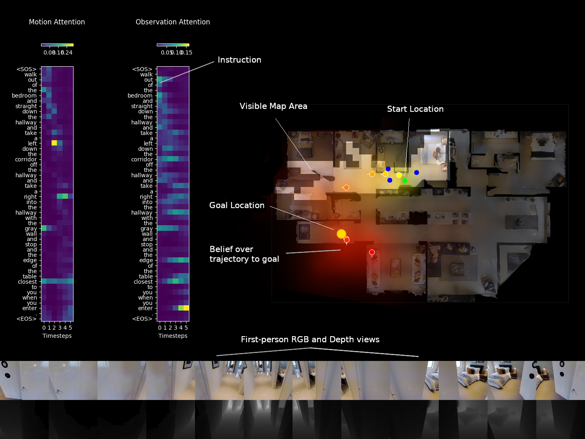

# vln-chasing-ghosts

Code for [Chasing Ghosts: Instruction Following as Bayesian State Tracking](https://arxiv.org/abs/1907.02022) published at NeurIPS 2019. 

We study the problem of instruction-guided navigation, using the R2R dataset for Vision-and-Language Navigation (VLN). We notice that navigation instructions are mostly just sequenced actions ('turn left...') and observations ('...at the kitchen'). Given a sequence of actions and observations, finding the goal looks a lot like a tracking problem. So we formulate instruction following as Bayesian state tracking. This gives us:
1. **Uncertainty**: an explicit probability for every possible trajectory the agent could take (naturally handles multimodal hypotheses); 
2. **Interpretability**: we can inspect the predicted goal location distribution, or even the motion model or observation model separately; and
3. **Performance**: Adding the machinery of Bayesian state tracking improves goal location prediction (compared to a similar deep net without these algorithmic priors).

Click the image below for a 4 minute video overview:

[](http://www.youtube.com/watch?v=eoGbescCNP0 "Demo video")

This code is based on a fork of the [Matterport3D Simulator](https://github.com/peteanderson80/Matterport3DSimulator). The original README for the simulator starts [here](#matterport3d-simulator).

## Reference

If you use our code, please cite our paper. The first two authors contributed equally.

### Bibtex:
```bibtex
@inproceedings{vln-chasing-ghosts,
  title={Chasing Ghosts: Instruction Following as Bayesian State Tracking},
  author={Peter Anderson and Ayush Shrivastava and Devi Parikh and Dhruv Batra and Stefan Lee},
  booktitle={Advances in Neural Information Processing Systems (NeurIPS)},
  year={2019}
}
```

## Installation / Build Instructions

We recommend using our [Dockerfile](Dockerfile).

### Prerequisites

- Nvidia GPU with driver >= 396.37
- Install [docker](https://docs.docker.com/engine/installation/)
- Install [nvidia-docker2.0](https://github.com/nvidia/nvidia-docker/wiki/Installation-(version-2.0))

### Clone Repo

Clone the the repository (make sure to clone with `--recursive`):
```
git clone --recursive https://github.com/batra-mlp-lab/vln-chasing-ghosts.git
cd vln-chasing-ghosts
```

### Downloading Datasets

Follow the instructions from the simulator under [Dataset Download](#dataset-download), [Dataset Preprocessing](#dataset-preprocessing) and [Depth Outputs](#depth-outputs) to download and preprocess the Matterport3D dataset including depth outputs.

To download the Room-to-Room (R2R) dataset, run:
```
./tasks/R2R/data/download.sh
```

### Build the Docker and simulator

Follow the [instructions from the simulator](#building-and-testing-using-docker) to build the docker, run the docker and build the simulator code.


## Experiments

Code for our model is contained in the `tracker` folder. Our model is composed of three parts:
1. A `mapper` that builds a semantic spatial map from CNN features extracted from first-person RGB-D images;
2. A `filter` that determines the most probable goal location in the current map by tracking the human demonstrator from observations and actions in the instruction; and
3. A simple `policy` that conditions on the belief map to execute actions that move towards the goal location.

### Setup

Before running experiments, first run the docker container, mounting both this repo and the Matterport dataset:
```
nvidia-docker run -it --mount type=bind,source=$MATTERPORT_DATA_DIR,target=/root/mount/Matterport3DSimulator/data/v1/scans,readonly --volume `pwd`:/root/mount/Matterport3DSimulator mattersim:9.2-devel-ubuntu18.04
```

To monitor experiments using [Visdom](https://github.com/facebookresearch/visdom), install Visdom by following instructions from [here](https://github.com/facebookresearch/visdom#setup).  
You can start the Visdom server using `python -m visdom.server -port <PORT>` .  

Use `-visdom` argument to turn on Visdom logging while running experiments and configure `-visdom_server` and if necessary `-visdom_port` to change the destination Visdom server. Make sure to start the Visdom server before running experiments if using `-visdom` argument.

### Goal Prediction Task 

We first assess the performance of the `mapper` and the `filter` at predicting the goal location given a fixed trajectory (experiments from Section 5.2 in the paper)

To train our model:
```
python3 tracker/train_filter.py -visdom -visdom_server $SERVER -preloading -exp_name Filter
```
where `$SERVER` is the hostname of the visdom server (see Setup above).

To train an ablated version without heading (only 1 heading bin in the state representation instead of 4):
```
python3 tracker/train_filter.py -visdom -visdom_server $SERVER -preloading -heading_states 1 -exp_name FilterNoHeading
```

To train the position-visitation network (PVN) baseline (based on LingUnet):
```
python3 tracker/train_pvn.py -visdom -visdom_server $SERVER -preloading -map_range_x 128 -map_range_y 128 -exp_name PVN
```

By default, models are trained for 15K iterations. Each script will checkpoint the model and perform 100 validation iterations every 500 training iterations. Training can be monitored in visdom.

To evaluate the trained models at a *specific checkpoint*, used the commands above but add `-eval -val_epoch $IT` where `$IT` is a selected checkpoint iteration, e.g. 11000.

To evaluate the trained models across *all checkpoints* please use the scripts with the naming scheme `tracker/scripts/eval_*.sh` (after updating the name of the visdom server in each script). At iteration 11K the results should be similar to Table 1. To evaluate over 8 timesteps as in Table 1, the argument `-timesteps 8` can be added during evaluation.

To evaluate the handcoded baseline, run:
```
python3 tracker/handcoded_baseline_.py -visdom -visdom_server $SERVER -exp_name Handcoded -timesteps 8
```

### Full Vision-and-Language Navigation Task

We also assess the performance of the `mapper` and the `filter` in combination with the `policy` on the full VLN task (i.e., not just predicting the goal location, but also attempting to reach it using the trained policy). The filter and policy are trained together. To train the full model (from Section 5.3 in the paper):
```
python3 tracker/train_policy.py -visdom -preloading -exp_name Policy
```

To evaluate the trained model at a *specific checkpoint*:
```
python3 tracker/train_policy.py -visdom -preloading -exp_name Policy -eval -val_epoch $IT
```
where `$IT` is a selected checkpoint iteration, e.g. 11000.

To evaluate the trained model across *all checkpoints* please use the script `tracker/scripts/eval_policy.sh` (after updating the name of the visdom server in the script). At the best iteration the results should be similar to Table 2.

------------------------------------------------------------------------------------------

*Original README for the simulator (parent repo):*

# Matterport3D Simulator
AI Research Platform for Reinforcement Learning from Real Panoramic Images.

The Matterport3D Simulator enables development of AI **agents that interact with real 3D environments using visual information** (RGB-D images). It is primarily intended for research in deep reinforcement learning, at the intersection of computer vision, natural language processing and robotics.


Visit the main [website](https://bringmeaspoon.org/) to view a demo.

*NEW February 2019*: We have released several updates. The simulator is now dockerized, it supports batches of agents instead of just a single agent, and it is far more efficient (faster) than before. Also, it now outputs depth maps as well as RGB images. As a consequence, there are some changes to the original API (mainly, all inputs and outputs are now batched). Therefore, to mark the first release we have tagged it as [v0.1](https://github.com/peteanderson80/Matterport3DSimulator/tree/v0.1) for any users that don't want to change to the new version. 

## Features
- Dataset consisting of 90 different predominantly indoor environments,
- Outputs RGB and depth images
- All images and depth maps are real, not synthetic (providing much more visual complexity),
- API for C++ and Python
- Customizable image resolution, camera parameters, etc,
- Supports off-screen rendering (both GPU and CPU based)
- Fast (Around 1000 fps RGB-D off-screen rendering at 640x480 resolution using a Titan X GPU)
- Unit tests for the rendering pipeline and agent's motions etc
- Future releases may support class and instance object segmentations.

## Reference

The Matterport3D Simulator and the Room-to-Room (R2R) navigation dataset are described in:
- [Vision-and-Language Navigation: Interpreting visually-grounded navigation instructions in real environments](https://arxiv.org/abs/1711.07280).

If you use the simulator or our dataset, please cite our paper (CVPR 2018 spotlight oral):

### Bibtex:
```
@inproceedings{mattersim,
  title={{Vision-and-Language Navigation}: Interpreting visually-grounded navigation instructions in real environments},
  author={Peter Anderson and Qi Wu and Damien Teney and Jake Bruce and Mark Johnson and Niko S{\"u}nderhauf and Ian Reid and Stephen Gould and Anton van den Hengel},
  booktitle={Proceedings of the IEEE Conference on Computer Vision and Pattern Recognition (CVPR)},
  year={2018}
}
```

## Simulator Data

Matterport3D Simulator is based on densely sampled 360-degree indoor RGB-D images from the [Matterport3D dataset](https://niessner.github.io/Matterport/). The dataset consists of 90 different indoor environments, including homes, offices, churches and hotels. Each environment contains full 360-degree RGB-D scans from between 8 and 349 viewpoints, spread on average 2.25m apart throughout the entire walkable floorplan of the scene.

### Actions

At each viewpoint location, the agent can pan and elevate the camera. The agent can also choose to move between viewpoints. The precise details of the agent's observations and actions are [described below](#simulator-api) and in the paper.

### Room-to-Room (R2R) Navigation Task

The simulator includes the training data and evaluation metrics for the Room-to-Room (R2R) Navigation task, which requires an autonomous agent to follow a natural language navigation instruction to navigate to a goal location in a previously unseen building. Please refer to [specific instructions](tasks/R2R/README.md) to setup and run this task. There is a test server and leaderboard available at [EvalAI](https://evalai.cloudcv.org/web/challenges/challenge-page/97/overview).

## Installation / Build Instructions

We recommend using our [Dockerfile](Dockerfile) to install the simulator. The simulator can also be [built without docker](#building-without-docker) but satisfying the project dependencies may be more difficult.

### Prerequisites

- Nvidia GPU with driver >= 396.37
- Install [docker](https://docs.docker.com/engine/installation/)
- Install [nvidia-docker2.0](https://github.com/nvidia/nvidia-docker/wiki/Installation-(version-2.0))
- Note: CUDA / CuDNN toolkits do not need to be installed (these are provided by the docker image)

### Clone Repo

Clone the Matterport3DSimulator repository:
```
# Make sure to clone with --recursive
git clone --recursive https://github.com/peteanderson80/Matterport3DSimulator.git
cd Matterport3DSimulator
```

If you didn't clone with the `--recursive` flag, then you'll need to manually clone the pybind submodule from the top-level directory:
```
git submodule update --init --recursive
```

### Dataset Download

To use the simulator you must first download the [Matterport3D Dataset](https://niessner.github.io/Matterport/) which is available after requesting access [here](https://niessner.github.io/Matterport/). The download script that will be provided allows for downloading of selected data types. 

Set an environment variable to the location of the dataset, where <PATH> is the full absolute path (not a relative path or symlink) to the directory containing the individual matterport scan directories (17DRP5sb8fy, 2t7WUuJeko7, etc):
```
export MATTERPORT_DATA_DIR=<PATH>
```

Note that if <PATH> is a remote sshfs mount, you will need to mount it with the `-o allow_root` option or the docker container won't be able to access this directory. 

### Dataset Preprocessing

To make data loading faster and to reduce memory usage we preprocess the `matterport_skybox_images` by downscaling and combining all cube faces into a single image using the following script:
```
./scripts/downsize_skybox.py
```

This will take a while depending on the number of processes used. By default images are downscaled by 50% and 20 processes are used.

#### Depth Outputs

If you need depth outputs as well as RGB (via `sim.setDepthEnabled(True)`), precompute matching depth skybox images by running this script (which requires the simulator code to be built first, and leave out the 'readonly' option from the commands provided when launching the docker container):
```
./scripts/depth_to_skybox.py
```

Depth skyboxes are generated from the `undistorted_depth_images` using a simple blending approach. As the depth images contain many missing values (corresponding to shiny, bright, transparent, and distant surfaces, which are common in the dataset) we apply a simple crossbilateral filter based on the [NYUv2](https://cs.nyu.edu/~silberman/datasets/nyu_depth_v2.html) code to fill all but the largest holes. A couple of things to keep in mind:
- We assume that the `undistorted depth images` are aligned to the `matterport_skybox_images`, but in fact this alignment is not perfect. For certain applications where better alignment is required (e.g., generating RGB pointclouds) it might be necessary to replace the `matterport_skybox_images` by stitching together `undistorted_color_images` (which are perfectly aligned to the `undistorted_depth_images`).
- In the generated depth skyboxes, the depth value is the euclidean distance from the camera center (not the distance in the z direction). This is corrected by the simulator (see Simulator API, below).


### Building and Testing using Docker

Build the docker image:
```
docker build -t mattersim:9.2-devel-ubuntu18.04 .
```

Run the docker container, mounting both the git repo and the dataset:
```
nvidia-docker run -it --mount type=bind,source=$MATTERPORT_DATA_DIR,target=/root/mount/Matterport3DSimulator/data/v1/scans,readonly --volume `pwd`:/root/mount/Matterport3DSimulator mattersim:9.2-devel-ubuntu18.04
```

Now (from inside the docker container), build the simulator and run the unit tests:
```
cd /root/mount/Matterport3DSimulator
mkdir build && cd build
cmake -DEGL_RENDERING=ON ..
make
cd ../
./build/tests ~Timing
```

Assuming all tests pass, `sim_imgs` will now contain some test images rendered by the simulator. You may also wish to test the rendering frame rate. The following command will try to load all the Matterport environments into memory (requiring around 80 GB memory), and then some information about the rendering frame rate (at 640x480 resolution) will be printed to stdout:
```
./build/tests Timing
```

The timing test must be run individually from the other tests to get accurate results. Refer to the [Catch](https://github.com/philsquared/Catch) documentation for unit test configuration options.


### Rendering Options (GPU, CPU, off-screen)

There are three rendering options, which are selected using [cmake](https://cmake.org/) options during the build process (by varying line 3 in the build commands immediately above):
- GPU rendering using OpenGL (requires an X server): `cmake ..` (default)
- Off-screen GPU rendering using [EGL](https://www.khronos.org/egl/): `cmake -DEGL_RENDERING=ON ..`
- Off-screen CPU rendering using [OSMesa](https://www.mesa3d.org/osmesa.html): `cmake -DOSMESA_RENDERING=ON ..`

The recommended (fast) approach for training agents is using off-screen GPU rendering (EGL).


### Interactive Demo

To run an interactive demo, build the docker image as described above (`docker build -t mattersim:9.2-devel-ubuntu18.04 .`), then run the docker container while sharing the host's X server and DISPLAY environment variable with the container:
```
xhost +
nvidia-docker run -it -e DISPLAY -v /tmp/.X11-unix:/tmp/.X11-unix --mount type=bind,source=$MATTERPORT_DATA_DIR,target=/root/mount/Matterport3DSimulator/data/v1/scans,readonly --volume `pwd`:/root/mount/Matterport3DSimulator mattersim:9.2-devel-ubuntu18.04
cd /root/mount/Matterport3DSimulator
```

If you get an error like `Error: BadShmSeg (invalid shared segment parameter) 128` you may also need to include `-e="QT_X11_NO_MITSHM=1"` in the docker run command above.

Build the simulator using any rendering option. Commands for running both python and C++ demos are provided below. These are very simple demos designed to illustrate the use of the simulator in python and C++. By default, *these demos have depth rendering off*. Check the code and turn it on if you have preprocessed the depth outputs and want to see depth as well (see Depth Outputs above). 

Python demo:
```
python3 src/driver/driver.py
```
C++ demo:
```
build/mattersim_main
```

The javascript code in the `web` directory can also be used as an interactive demo, or to generate videos from the simulator in first-person view, or as an interface on Amazon Mechanical Turk to collect natural language instruction data. 


### Building without Docker

The simulator can be built outside of a docker container using the cmake build commands described above. However, this is not the recommended approach, as all dependencies will need to be installed locally and may conflict with existing libraries. The main requirements are:
- Ubuntu >= 14.04
- Nvidia-driver with CUDA installed 
- C++ compiler with C++11 support
- [CMake](https://cmake.org/) >= 3.10
- [OpenCV](http://opencv.org/) >= 2.4 including 3.x
- [OpenGL](https://www.opengl.org/)
- [GLM](https://glm.g-truc.net/0.9.8/index.html)
- [Numpy](http://www.numpy.org/)

Optional dependences (depending on the cmake rendering options):
- [OSMesa](https://www.mesa3d.org/osmesa.html) for OSMesa backend support
- [epoxy](https://github.com/anholt/libepoxy) for EGL backend support

The provided [Dockerfile](Dockerfile) contains install commands for most of these libraries. For example, to install OpenGL and related libraries:
```
sudo apt-get install libjsoncpp-dev libepoxy-dev libglm-dev libosmesa6 libosmesa6-dev libglew-dev
```

### Simulator API

The simulator [API in Python](src/lib_python/MatterSimPython.cpp) exactly matches the extensively commented [MatterSim.hpp](include/MatterSim.hpp) C++ header file, but using python lists in place of C++ std::vectors etc. In general, there are various functions beginning with `set` that set the agent and simulator configuration (such as batch size, rendering parameters, enabling depth output etc). For training agents, we recommend setting `setPreloadingEnabled(True)`, `setBatchSize(X)` and `setCacheSize(2X)`, where X is the desired batch size, e.g.:
```
import MatterSim
sim = MatterSim.Simulator()
sim.setCameraResolution(640, 480)
sim.setPreloadingEnabled(True)
sim.setDepthEnabled(True)
sim.setBatchSize(100)
sim.setCacheSize(200) # cacheSize 200 uses about 1.2GB of GPU memory for caching pano textures
``` 

When preloading is enabled, all the pano images will be loaded into memory before starting. Preloading takes several minutes and requires around 50G memory for RGB output (about 80G if depth output is enabled), but rendering is much faster. 

To start the simulator, call `initialize` followed by the `newEpisode` function, which takes as arguments a list of scanIds, a list of viewpoint ids, a list of headings (in radians), and a list of camera elevations (in radians), e.g.:
```
sim.initialize()
# Assuming batchSize = 1
sim.newEpisode(['2t7WUuJeko7'], ['1e6b606b44df4a6086c0f97e826d4d15'], [0], [0])
```

Heading is defined from the y-axis with the z-axis up (turning right is positive). Camera elevation is measured from the horizon defined by the x-y plane (up is positive). There is also a `newRandomEpisode` function which only requires a list of scanIds, and randomly determines a viewpoint and heading (with zero camera elevation). 

Interaction with the simulator is through the `makeAction` function, which takes as arguments a list of navigable location indices, a list of heading changes (in radians) and a list of elevation changes (in radians). The navigable location indices select which nearby camera viewpoint the agent should move to. *By default, only camera viewpoints that are within the agent's current field of view are considered navigable, unless restricted navigation is turned off* (i.e., the agent can't move backwards, for example). For agent `n`, navigable locations are given by `getState()[n].navigableLocations`. Index 0 always contains the current viewpoint (i.e., the agent always has the option to stay in the same place). As the navigation graph is irregular, the remaining viewpoints are sorted by their angular distance from the centre of the image, so index 1 (if available) will approximate moving directly forward. For example, to turn 30 degrees left without moving (keeping camera elevation unchanged): 
```
sim.makeAction([0], [-0.523599], [0])
```

At any time the simulator state can be returned by calling `getState`. The returned state contains a list of objects (one for each agent in the batch), with attributes as in the following example:
```javascript
[
  {
    "scanId" : "2t7WUuJeko7"  // Which building the agent is in
    "step" : 5,               // Number of frames since the last newEpisode() call
    "rgb" : <image>,          // 8 bit image (in BGR channel order), access with np.array(rgb, copy=False)
    "depth" : <image>,        // 16 bit single-channel image containing the pixel's distance in the z-direction from the camera center 
                              // (not the euclidean distance from the camera center), 0.25 mm per value (divide by 4000 to get meters). 
                              // A zero value denotes 'no reading'. Access with np.array(depth, copy=False)
    "location" : {            // The agent's current 3D location
        "viewpointId" : "1e6b606b44df4a6086c0f97e826d4d15",  // Viewpoint identifier
        "ix" : 5,                                            // Viewpoint index, used by simulator
        "x" : 3.59775996208,                                 // 3D position in world coordinates
        "y" : -0.837355971336,
        "z" : 1.68884003162,
        "rel_heading" : 0,                                   // Robot relative coords to this location
        "rel_elevation" : 0,
        "rel_distance" : 0
    }
    "heading" : 3.141592,     // Agent's current camera heading in radians
    "elevation" : 0,          // Agent's current camera elevation in radians
    "viewIndex" : 0,          // Index of the agent's current viewing angle [0-35] (only valid with discretized viewing angles)
                              // [0-11] is looking down, [12-23] is looking at horizon, is [24-35] looking up
    "navigableLocations": [   // List of viewpoints you can move to. Index 0 is always the current viewpoint, i.e. don't move.
        {                     // The remaining valid viewpoints are sorted by their angular distance from the image centre.
            "viewpointId" : "1e6b606b44df4a6086c0f97e826d4d15",  // Viewpoint identifier
            "ix" : 5,                                            // Viewpoint index, used by simulator
            "x" : 3.59775996208,                                 // 3D position in world coordinates
            "y" : -0.837355971336,
            "z" : 1.68884003162,
            "rel_heading" : 0,                                   // Robot relative coords to this location
            "rel_elevation" : 0,
            "rel_distance" : 0
        },
        {
            "viewpointId" : "1e3a672fa1d24d668866455162e5b58a",  // Viewpoint identifier
            "ix" : 14,                                           // Viewpoint index, used by simulator
            "x" : 4.03619003296,                                 // 3D position in world coordinates
            "y" : 1.11550998688,
            "z" : 1.65892004967,
            "rel_heading" : 0.220844170027,                      // Robot relative coords to this location
            "rel_elevation" : -0.0149478448723,
            "rel_distance" : 2.00169944763
        },
        {...}
    ]
  }
]
```

Refer to [src/driver/driver.py](src/driver/driver.py) for example usage. To build html docs for C++ classes in the `doxygen` directory, run this command and navigate in your browser to `doxygen/html/index.html`:
```
doxygen
```


### Precomputing ResNet Image Features

In our initial work using this simulator, we discretized heading and elevation into 30 degree increments, and precomputed image features for each view. Now that the simulator is much faster, this is no longer necessary, but for completeness we include the details of this setting below.

We generate image features using Caffe. To replicate our approach, first download and save some Caffe ResNet-152 weights into the `models` directory. We experiment with weights pretrained on [ImageNet](https://github.com/KaimingHe/deep-residual-networks), and also weights finetuned on the [Places365](https://github.com/CSAILVision/places365) dataset. The script `scripts/precompute_features.py` can then be used to precompute ResNet-152 features. Features are saved in tsv format in the `img_features` directory. 

Alternatively, skip the generation and just download and extract our tsv files into the `img_features` directory:
- [ResNet-152-imagenet features [380K/2.9GB]](https://www.dropbox.com/s/715bbj8yjz32ekf/ResNet-152-imagenet.zip?dl=1)
- [ResNet-152-places365 features [380K/2.9GB]](https://www.dropbox.com/s/gox1rbdebyaa98w/ResNet-152-places365.zip?dl=1)


### Directory Structure

- `connectivity`: Json navigation graphs.
- `webgl_imgs`: Contains dataset views rendered with javascript (for test comparisons).
- `sim_imgs`: Will contain simulator rendered images after running tests.
- `models`: Caffe models for precomputing ResNet image features.
- `img_features`: Storage for precomputed image features.
- `data`: Matterport3D dataset.
- `tasks`: Currently just the Room-to-Room (R2R) navigation task.
- `web`: Javascript code for visualizing trajectories and collecting annotations using Amazon Mechanical Turk (AMT).

Other directories are mostly self-explanatory.


## License

The Matterport3D dataset, and data derived from it, is released under the [Matterport3D Terms of Use](http://dovahkiin.stanford.edu/matterport/public/MP_TOS.pdf). Our code is released under the MIT license.

## Acknowledgements

We would like to thank Matterport for allowing the Matterport3D dataset to be used by the academic community. This project is supported by a Facebook ParlAI Research Award and by the [Australian Centre for Robotic Vision](https://www.roboticvision.org/).

## Contributing

We welcome contributions from the community. All submissions require review and in most cases would require tests.
